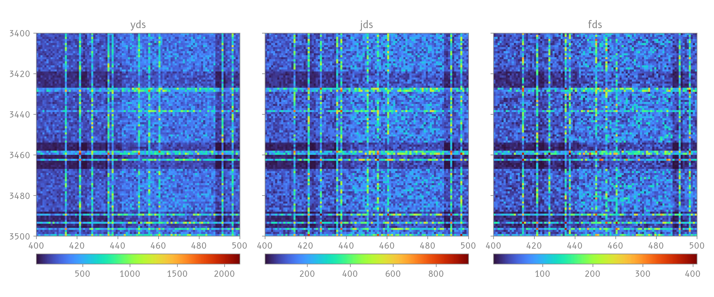
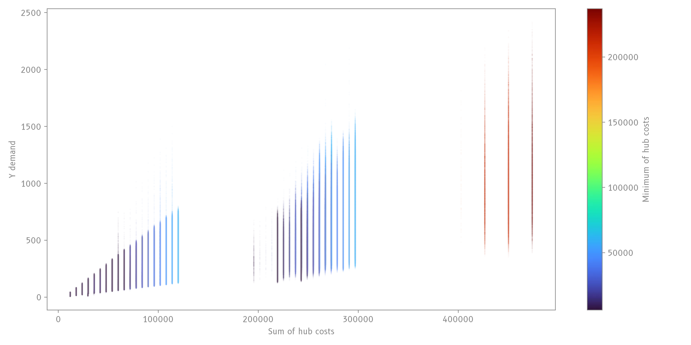
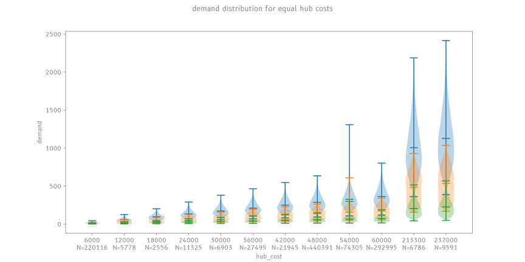
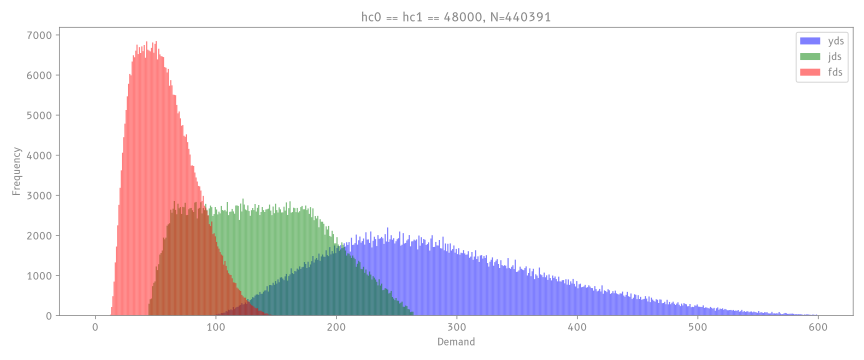
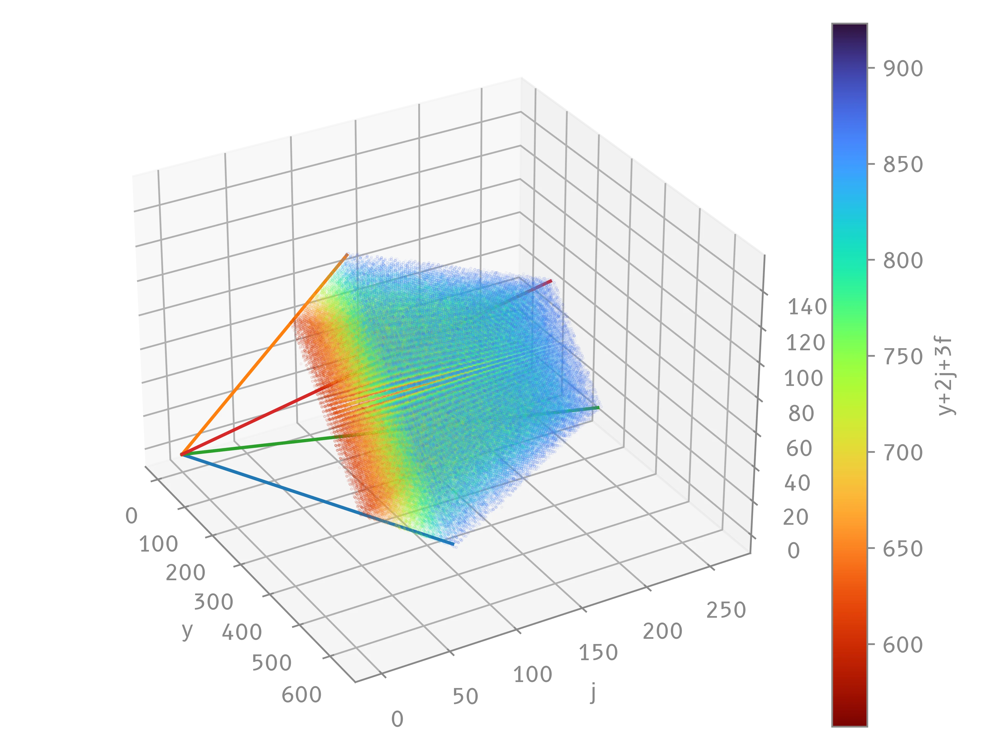

!!! note
    This is not a guide, but documentation for an ongoing effort to uncover the demand formula. If you'd like to help, please contact me!

## Basic Observations

There are $n=3907$ airports in the game. A route can be constructed between two airports, and are associated with a **unique, undirected** demand. This means there are $\frac{n(n-1)}{2}=7630371$ possible demand values in the game!

Right now, we store each demand value in a giant database, and the goal is to find a *compressed* formula that generates the demand instead.

Here's a visualisation of the data I've collected back in early 2020:

This matrix shows the $y$ demand between airport ID $i$ (x axis) and airport ID $j$ (y axis). Note that since $D_{i \rightarrow j}=D_{j \rightarrow i}$, the upper right triangle is essentially a mirror of the bottom left.

A closer slice:

Some observations:

- airports with greater base hub cost $C$ tend to yield greater *average* demand.
- very high demand (red dots) are sometimes located at intersections between two high-hub-cost pairs.
- values are highly randomised and have little correlation between $y$, $j$, $f$.

To confirm this, I decided to group demands based on the total hub cost for each pair:

Indeed, the expected y demand grows linearly with the sum of hub cost ($C_i+C_j$) and exhibits heteroscedasticity. The behaviour also appears to differ based on whether each airport is capital ($\text{C}$) or non capital ($\text{C}'$).

There are three groups here (left-to-right): $\text{C}'\text{C}'$, $\text{C}'\text{C}$ and $\text{C}\text{C}$. There also appears to be two types of capital airports that cause partial overlap in the middle.

Another interesting this I noticed is, the max/min bounds seem rather clear-cut! Maybe it is sampled from a uniform distribution $[a,b]$, where $a$ and $b$ are also functions of the sum of hub costs?

I'm imagining that $y$, $j$, $f$ are generated from an LCG and maybe we could crack the seed from the massive data we have.

Since the first group seem to grow more predictably, I'll focus on analyses where both hub costs matches each other.

## Distributions

Here's a violin plot for all combinations:

The yellow, orange, green violins correspond to $y$, $j$, $f$. But they do not seem to be uniform distributions! A closer look:

$y$ and $f$ look Possion while $j$ looks trapezoidal. This means $y$, $j$, $f$ could not be generated simply from a `rand()` function.

Confused, I tried plotting the $y$, $j$, $f$ on a 3D space:

It seems much more promising here. The possible $y$, $j$, $f$ values live in some "pinhole camera"-like space with very clear bounds!

One dimension also seem to correspond to the equivalent demand $y+2j+3f$.

## Hypothesis for algorithm

What I think is happening here is:

1. one pseudorandom value is first generated for the equivalent demand.
2. two pseudorandom values are generated in $[0, 1]$, corresponding to how economy-like or business-like the route is
3. a non-affine transformation is then applied and used to compute $y$, $j$, $f$.

Just to make sure step 1 is indeed the case:

It looks to be uniformly distributed, a great sign :)

The two peaks (600-603 and 800-803) and the way the distribution tapers off on both sides seem suspicious.

## Future work

- construct the transformation matrix that does the reverse operation
- determine if it's even possible to crack the PRNG