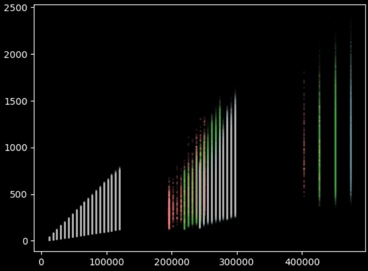

# observations
id 1762, hc override 2123300

id 1763, hc override 6000
```
[(6000, 665),
 (12000, 108),
 (18000, 72),
 (24000, 151),
 (30000, 118),
 (36000, 235),
 (42000, 210),
 (48000, 939),
 (54000, 385),
 (60000, 766),
 (189600, 1),
 (213300, 118),
 (237000, 139)]
 ```

## average y demand

**capital**

$0.0033164284947724376C + 119.41009220997694$, R=0.9997504779305951

**non-capital**

$0.0016345993983034792C + 243.24879894634665$, R=0.9857984468597706

## sum of demands

hc0+hc1 distribution
```
[(12000, 220780),
 (18000, 71820),
 (24000, 53658),
 (30000, 108191),
 (36000, 97334),
 (42000, 179891),
 (48000, 184851),
 (54000, 681853),
 (60000, 414945),
 (66000, 678018),
 (72000, 304512),
 (78000, 273439),
 (84000, 403706),
 (90000, 378053),
 (96000, 701251),
 (102000, 522375),
 (108000, 793194),
 (114000, 294910),
 (120000, 292995),
 (195600, 665),
 (201600, 108),
 (207600, 72),
 (213600, 151),
 (219300, 78470),
 (219600, 118),
 (225300, 12744),
 (225600, 235),
 (231300, 8496),
 (231600, 210),
 (237300, 17818),
 (237600, 939),
 (243000, 92435),
 (243300, 13924),
 (243600, 385),
 (249000, 15012),
 (249300, 27730),
 (249600, 766),
 (255000, 10008),
 (255300, 24780),
 (261000, 20989),
 (261300, 110802),
 (267000, 16402),
 (267300, 45430),
 (273000, 32665),
 (273300, 90388),
 (279000, 29190),
 (285000, 130521),
 (291000, 53515),
 (297000, 106474),
 (402900, 118),
 (426600, 7042),
 (450300, 16402),
 (474000, 9591)]
 ```

suppose we have route 0 -> 1 and 2 -> 3: $D(hc_0 + hc_1) \neq D(hc_2 + hc_3)$!


capital + noncapital regressions:

red (189600): $0.0063638927378352065C-920.5892261010322$, 0.5703502250153284

green (213300): $0.006381998158987361C-1037.968079577387$, 0.5447662113767922

blue (237000): $0.0063772521619784835C-1149.4275766892279$, 0.5337118880835734

3.356483511516459e-08 -0.004855428407705866
2.992029141578697e-08 -0.0048662357223506186
2.690823697037335e-08 -0.00484990538687438